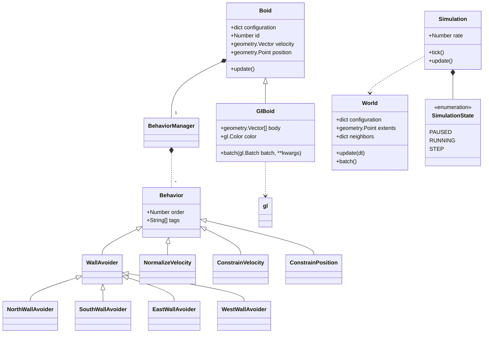
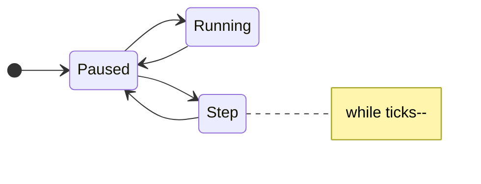

# Boids

Back-end Python service which implements the Boid behavior.

## Development Environment

### Prerequisites:

- Elasticsearch
- NATS

### Running inside the container
```
user@host:~ ./boids-gateway.py -v /etc/boids/*
2023-10-28T18:07:12 DEBUG             boids_utils.elastic: Connecting to http://elasticsearch.boids:9200...
.
.
.
```
### Running Unit Tests
```
$ cd /opt/boids-gateway
$ clear; pytest
```

**Warning: Nees update!**



